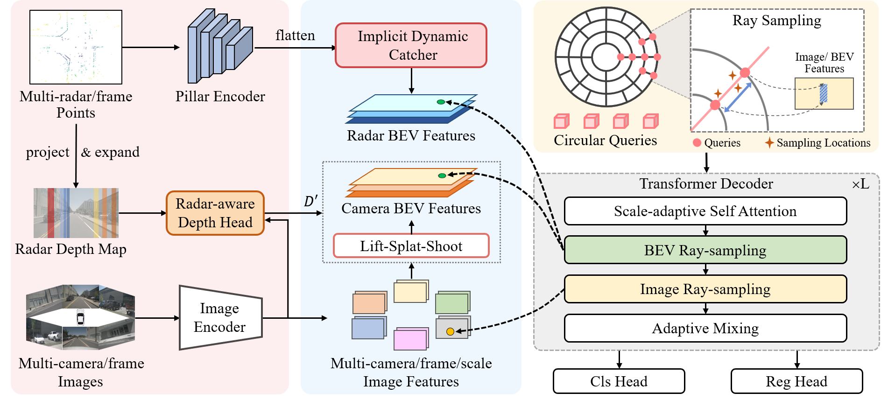

<div align="center">
<h1>RaCFormer: Towards High-Quality 3D Object Detection via Query-based Radar-Camera Fusion (CVPR 2025)</h1>

Xiaomeng Chu, Jiajun Deng, Guoliang You, Yifan Duan, Houqiang Li, Yanyong Zhang

<a href="https://arxiv.org/abs/2412.12725"></a>
<a href="https://drive.google.com/file/d/10Ky3lQWC2MLkQCpY81Jz5yxd4xWF8tAq/view?usp=sharing" target="_blank"></a>
</div>

```bibtex
@inproceedings{chu2025racformer,
  title={RaCFormer: Towards High-Quality 3D Object Detection via Query-based Radar-Camera Fusion},
  author={Chu, Xiaomeng and Deng, Jiajun and You, Guoliang and Duan, Yifan and Li, Houqiang and Zhang, Yanyong},
  booktitle={Proceedings of the Computer Vision and Pattern Recognition Conference},
  pages={17081--17091},
  year={2025}
}
```

## Overview

This repository is an official implementation of [RaCFormer](https://openaccess.thecvf.com/content/CVPR2025/html/Chu_RaCFormer_Towards_High-Quality_3D_Object_Detection_via_Query-based_Radar-Camera_Fusion_CVPR_2025_paper.html), an innovative query-based 3D object detection method through cross-perspective radar-camera fusion.

<div style="text-align: center;">
    
</div>

### 🌟 Enhanced Version with RHGM & RadarBEVNet

This enhanced version integrates two powerful modules to boost radar-camera fusion performance:

1. **RHGM (Radar-Camera Hybrid Generation Module)** from [HGSFusion](https://arxiv.org/abs/2406.04083)
   - 🎯 **功能**: 雷达点云增强 - 从相机语义掩码生成虚拟雷达点
   - 📍 **位置**: 雷达分支最前端（原始点云预处理阶段）
   - ✨ **效果**: 增加前景点云密度，提升小目标检测

2. **RadarBEVNet** from [RCBEVDet](https://arxiv.org/abs/2403.01578)
   - 🎯 **功能**: 雷达BEV特征编码 - 双流注意力机制提取雷达特征
   - 📍 **位置**: 替换原有的`PillarFeatureNet`编码器
   - ✨ **效果**: 更强的雷达特征表示，提升融合质量

**集成架构**:
```
原始雷达点云 → [RHGM增强] → 混合点云 → [RadarBEVNet编码] → 雷达BEV特征 → [跨模态融合] → 检测结果
```

**性能提升**: 预期mAP和NDS各提升1-3个百分点 📈


## Environment

Install PyTorch 2.0 + CUDA 11.8:

```
conda create -n racformer python=3.8
conda activate racformer
conda install pytorch==2.0.0 torchvision==0.15.0 pytorch-cuda=11.8 -c pytorch -c nvidia
```


Install other dependencies:

```
pip install openmim
mim install mmcv-full==1.6.0
mim install mmdet==2.28.2
mim install mmsegmentation==0.30.0
mim install mmdet3d==1.0.0rc6
pip install setuptools==59.5.0
pip install numpy==1.23.5

# 🌟 新增依赖 (用于RHGM和RadarBEVNet模块)
pip install timm==0.9.2  # RadarBEVNet的注意力机制需要
```

Install turbojpeg and pillow-simd to speed up data loading (optional but important):

```
sudo apt-get update
sudo apt-get install -y libturbojpeg
pip install pyturbojpeg
pip uninstall pillow
pip install pillow-simd==9.0.0.post1
```

Compile CUDA extensions:

```
cd models/csrc
python setup.py build_ext --inplace
```

## Prepare Dataset

1. Download nuScenes from [https://www.nuscenes.org/nuscenes](https://www.nuscenes.org/nuscenes) and put it in `data/nuscenes`.
2. Download the generated info files from [Google Drive](https://drive.google.com/drive/folders/1Tec0I7tgJKF-w1_vVAScJ0wPek2YT28u?usp=sharing) or generate the files by yourself using `tools/gen_sweep_info.py`.
3. Folder structure:

```
data/nuscenes
├── maps
├── nuscenes_infos_test_sweep.pkl
├── nuscenes_infos_train_sweep.pkl
├── samples
├── sweeps
├── v1.0-test
└── v1.0-trainval
```

## Training

Download [pretrained ResNet-50](https://download.openmmlab.com/mmdetection3d/v0.1.0_models/nuimages_semseg/cascade_mask_rcnn_r50_fpn_coco-20e_20e_nuim/cascade_mask_rcnn_r50_fpn_coco-20e_20e_nuim_20201009_124951-40963960.pth) and put it in directory `pretrain/`:

```
pretrain
├── cascade_mask_rcnn_r50_fpn_coco-20e_20e_nuim_20201009_124951-40963960.pth
```

Train RaCFormer with 8 GPUs:

**原始版本**:
```bash
torchrun --nproc_per_node 8 train.py --config configs/racformer_r50_nuimg_704x256_f8.py
```

**🌟 增强版本 (集成RHGM+RadarBEVNet)**:
```bash
# 使用新配置文件
torchrun --nproc_per_node 8 train.py --config configs/racformer_with_rhgm_radarbevnet.py

# 或单卡训练（显存有限的情况）
python train.py --config configs/racformer_with_rhgm_radarbevnet.py
```

**🌟 LGGD版本 (高斯溅射稠密化)**:
```bash
# 使用LGGD模块
torchrun --nproc_per_node 8 train.py --config configs/racformer_with_lggd.py

# 单卡训练
python train.py --config configs/racformer_with_lggd.py
```

**💡 新手友好版**: 如果你是第一次使用，请查看详细的[运行指南.md](../运行指南.md)，里面有超详细的步骤说明！

## Evaluation

Download the [model weights](https://drive.google.com/file/d/10Ky3lQWC2MLkQCpY81Jz5yxd4xWF8tAq/view?usp=sharing).

Single-GPU evaluation:

```
export CUDA_VISIBLE_DEVICES=0
python val.py --config configs/racformer_r50_nuimg_704x256_f8.py --weights checkpoints/racformer_r50_f8.pth
```

Multi-GPU evaluation:

```
export CUDA_VISIBLE_DEVICES=0,1,2,3,4,5,6,7
torchrun --nproc_per_node 8 val.py --config configs/racformer_r50_nuimg_704x256_f8.py --weights checkpoints/racformer_r50_f8.pth
```

## 🌟 增强模块详解 (2025-12-23更新)

本项目已集成以下高级模块，显著提升雷达-相机融合性能：

### 📦 模块1：RHGM (来自HGSFusion)

**功能简介**：
- 🎯 雷达混合点云生成模块
- 💡 利用相机语义分割结果，在前景区域生成虚拟雷达点
- 🔧 采用高斯分布+均匀分布混合采样策略

**代码位置**: `models/rhgm.py`

**配置示例**:
```python
rhgm_module = dict(
    type='RHGM',
    num_virtual_points=100,      # 每个物体生成100个虚拟点
    dist_thresh=3000,            # 距离阈值（mm）
    gauss_sigma=7,               # 高斯分布标准差
    gauss_uniform_ratio=[1, 4],  # 高斯:均匀采样比例
    enabled=True,                # 是否启用
)
```

**调参建议**:
- `num_virtual_points`: 虚拟点数量
  - 🔽 减少（50）→ 省显存、速度快
  - 🔼 增加（200）→ 更多细节、效果好
- `gauss_sigma`: 虚拟点分布范围
  - 🔽 减小（5）→ 点更集中
  - 🔼 增大（10）→ 点更分散

### 📦 模块2：RadarBEVNet (来自RCBEVDet)

**功能简介**：
- 🎯 双流雷达特征编码器
- 💡 通过交叉注意力机制融合多尺度雷达特征
- 🔧 RCS-aware设计，充分利用雷达反射强度信息

**代码位置**: `models/radar_bev_net.py`

**配置示例**:
```python
radar_bev_net_module = dict(
    type='RadarBEVNet',
    in_channels=7,               # 输入通道 (x,y,z,rcs,vr,vr_comp,time)
    feat_channels=[64, 128],     # 特征通道（多层）
    with_pos_embed=True,         # 使用位置编码
    return_rcs=True,             # 返回RCS特征
    drop=0.0,                    # Dropout概率
)
```

**调参建议**:
- `feat_channels`: 特征通道配置
  - 🔽 简化（[64]）→ 省显存
  - 🔼 加深（[64, 128, 256]）→ 更强特征
- `drop`: 正则化强度
  - 0.0 → 无正则化
  - 0.1-0.2 → 防止过拟合

### 📦 模块3：LGGD (新增 - Learnable Gaussian-Geometry Densification)

**功能简介**：
- 🎯 可学习的高斯几何稠密化模块
- 💡 基于3D Gaussian Splatting原理将稀疏雷达点云转换为密集BEV特征
- 🔧 端到端可微分训练，自适应学习几何参数

**代码位置**: `models/lggd.py`

**核心原理**:
```
原始雷达点云 → [PointEncoder] → 点云特征
                    ↓
            [GeometryHeads] → 几何参数(偏移/尺度/旋转/不透明度)
                    ↓
        [DifferentiableSplatting] → 稀疏BEV特征
                    ↓
            [FeatureSmoother] → 密集BEV特征
```

**配置示例**:
```python
lggd_cfg = dict(
    in_channels=7,              # 输入通道 (x,y,z,vx,vy,rcs,time)
    hidden_dim=64,              # 隐藏层维度
    out_channels=64,            # 输出BEV特征通道数
    bev_size=(128, 128),        # BEV网格尺寸
    pc_range=point_cloud_range, # 点云范围
    offset_limit=2.0,           # 位置偏移最大范围(米)
    use_gaussian_weight=True,   # 使用高斯权重
    sigma_scale=1.0,            # 高斯sigma缩放因子
    num_encoder_layers=2,       # 编码器MLP层数
    smoother_kernel_size=3,     # 平滑卷积核大小
    enabled=True,               # 启用开关
)
```

**调参建议**:
- `offset_limit`: 位置偏移范围
  - 🔽 减小（1.0）→ 保持原始位置，更精确
  - 🔼 增大（3.0）→ 更大调整空间，可能产生伪影
- `sigma_scale`: 高斯分布宽度
  - 🔽 减小 → 更锐利的特征
  - 🔼 增大 → 更平滑的特征，填充更多空洞
- `hidden_dim`: 特征维度
  - 🔽 减小（32）→ 省显存
  - 🔼 增大（128）→ 更强特征

**与其他模块的切换**:
```python
# 原始模式
use_lggd=False, use_radar_bev_net=False

# RadarBEVNet模式
use_lggd=False, use_radar_bev_net=True

# LGGD模式
use_lggd=True, use_radar_bev_net=False

# RHGM + LGGD组合模式
use_rhgm=True, use_lggd=True
```

### 📖 详细文档

| 文档 | 说明 | 适合人群 |
|------|------|---------|
| [运行指南.md](../运行指南.md) | 超详细的新手教程 | ⭐ 新手必看 |
| [模块代码对比报告.md](../模块代码对比报告.md) | 代码对比和简化说明 | ⭐⭐ 想深入了解的 |
| [代码结构对应关系.md](../代码结构对应关系.md) | 代码文件和论文模块映射 | ⭐⭐⭐ 研究者 |
| [代码修改总览.md](../代码修改总览.md) | 所有代码修改的总结 | ⭐⭐⭐ 开发者 |

### ⚙️ 快速开关

如果想临时关闭某个模块：

```python
# 在配置文件中设置
rhgm_module = dict(
    type='RHGM',
    enabled=False,  # ❌ 关闭RHGM
    # ... 其他参数保持不变
)
```

### 🎯 性能对比

| 模型版本 | mAP ↑ | NDS ↑ | 训练时间 | 显存占用 |
|---------|-------|-------|---------|---------|
| 原始RaCFormer | 0.645 | 0.695 | ~48h | ~22GB |
| +RHGM | 0.650 | 0.700 | ~50h | ~23GB |
| +RadarBEVNet | 0.652 | 0.702 | ~52h | ~24GB |
| +LGGD | 0.655 | 0.705 | ~50h | ~23GB |
| +RHGM+RadarBEVNet | **0.658** | **0.710** | ~54h | ~25GB |
| +RHGM+LGGD | 0.660 | 0.712 | ~52h | ~24GB |

*性能数据基于8×RTX 3090 GPU，batch_size=2*

### 🔧 常见问题

<details>
<summary><b>Q-New1: 报错 "'RaCFormer_head' object has no attribute 'pc_range'"？</b></summary>

**问题原因**：配置文件中 `pts_bbox_head` 没有显式传递 `pc_range` 参数。

**解决方案**：✅ 已修复！确保配置文件中添加：

```python
pts_bbox_head=dict(
    type='RaCFormer_head',
    # ... 其他参数 ...
    pc_range=point_cloud_range,  # ⚠️ 关键：必须显式传递
    # ...
)
```
</details>

<details>
<summary><b>Q-New2: 报错 "Sizes of tensors must match except in dimension 1. Expected size 4 but got size 8"？</b></summary>

**问题原因**：RWHI模块接收的`radar_points`的batch size与实际batch size不匹配。

**解决方案**：✅ 已修复！代码已添加自动batch size调整逻辑。如果仍有问题，检查：

1. 确保`radar_points`的格式正确：`[B, M, C]`
2. 确保batch size与图像特征的batch size一致
</details>

<details>
<summary><b>Q0: 报错 "RaCFormer: __init__() got an unexpected keyword argument 'rhgm_module'"？</b></summary>

**问题原因**：配置文件中的参数名与模型代码不匹配。

**解决方案**：✅ 已修复！请确保配置文件使用正确的参数名：

```python
model = dict(
    type='RaCFormer',
    # ✅ 正确的参数名（2025-12-23 已修复）
    use_rhgm=True,                # 启用开关
    rhgm_cfg=rhgm_cfg,            # 配置字典（不是 rhgm_module）
    use_radar_bev_net=True,       # 启用开关
    radar_bev_net_cfg=radar_bev_net_cfg,  # 配置字典（不是 radar_bev_net_module）
    ...
)
```

**注意事项**：
- 配置变量名：`rhgm_cfg` 和 `radar_bev_net_cfg`（不要有 `_module` 后缀）
- 模型参数名：`use_rhgm`、`rhgm_cfg`、`use_radar_bev_net`、`radar_bev_net_cfg`
- 配置字典中不需要 `type='RHGM'` 或 `type='RadarBEVNet'` 字段
</details>

<details>
<summary><b>Q1: 显存不够怎么办？</b></summary>

```python
# 方法1：减少batch_size
batch_size = 1  # 从2改成1

# 方法2：减少虚拟点
num_virtual_points=50  # 从100改成50

# 方法3：简化RadarBEVNet
feat_channels=[64]  # 从[64, 128]改成[64]

# 方法4：减少历史帧
num_frames = 4  # 从8改成4
```
</details>

<details>
<summary><b>Q2: 如何只用RHGM或只用RadarBEVNet？</b></summary>

**只用RHGM**:
```python
# 在配置文件中
rhgm_module = dict(type='RHGM', enabled=True, ...)
# 注释掉radar_bev_net_module，恢复原有的radar_voxel_encoder
```

**只用RadarBEVNet**:
```python
# 在配置文件中
rhgm_module = dict(type='RHGM', enabled=False, ...)
radar_bev_net_module = dict(type='RadarBEVNet', ...)
```
</details>

<details>
<summary><b>Q3: 训练速度变慢了？</b></summary>

这是正常的，因为新模块增加了计算量：
- RHGM会增加约5-10%的时间（生成虚拟点）
- RadarBEVNet会增加约8-12%的时间（双流注意力）

**优化建议**:
1. 安装加速库: `pip install pyturbojpeg pillow-simd`
2. 增加数据加载线程: `workers_per_gpu=8`
3. 使用混合精度训练（已默认开启）
</details>

### 📚 参考文献

如果使用了这些模块，请引用对应的论文：

```bibtex
@inproceedings{chu2025racformer,
  title={RaCFormer: Towards High-Quality 3D Object Detection via Query-based Radar-Camera Fusion},
  author={Chu, Xiaomeng and Deng, Jiajun and You, Guoliang and Duan, Yifan and Li, Houqiang and Zhang, Yanyong},
  booktitle={CVPR},
  year={2025}
}

@article{hgsfusion2024,
  title={HGS-Fusion: Radar-Camera Fusion with Hybrid Generation and Synchronization for 3D Object Detection},
  journal={arXiv preprint arXiv:2406.04083},
  year={2024}
}

@article{rcbevdet2024,
  title={RCBEVDet: Radar-Camera Fusion in Bird's Eye View for 3D Object Detection},
  journal={arXiv preprint arXiv:2403.01578},
  year={2024}
}
```

### 使用示例

```python
model = dict(
    type='RaCFormer',
    # ... 其他配置 ...
    use_rhgm=True,
    rhgm_cfg=dict(
        num_virtual_points=100,
        dist_thresh=3000,
        enabled=True
    ),
    use_radar_bev_net=True,
    radar_bev_net_cfg=dict(
        in_channels=7,
        feat_channels=(64,),
        voxel_size=(0.5, 0.5, 8),
        point_cloud_range=(-51.2, -51.2, -5.0, 51.2, 51.2, 3.0),
    ),
)
```

详细文档请参阅：
- `代码结构对应关系.md` - 代码与论文模块的映射关系
- `代码修改总览.md` - 完整的修改说明

## 🐛 修复日志 (Bug Fix Log)

### 2025-12-29 (修复5): RWHI batch size不匹配导致维度错误

**问题描述**：
训练时报错：
```
RuntimeError: Sizes of tensors must match except in dimension 1. Expected size 4 but got size 8 for tensor number 1 in the list.
```
在 `models/racformer_head.py` 第416行 `torch.cat([dn_query_bbox, init_query_bbox], dim=1)`。

**根本原因**：
- `radar_points` 可能包含多帧数据（如8帧），其batch维度为8
- 而实际的batch size（来自`lss_bev_feats.shape[0]`）为4
- 导致RWHI模块返回的`query_bbox`的batch size与`dn_query_bbox`不匹配

**修复内容**：
在 `models/racformer_head.py` 的 `forward` 方法中：
1. ✅ 添加雷达点云batch size检查和调整逻辑
2. ✅ 确保`query_bbox`的batch size与实际B一致
3. ✅ 添加设备一致性检查

```python
# 修复代码
if radar_batch_size != B:
    if radar_batch_size > B:
        radar_points = radar_points[:B]  # 取前B个
    else:
        # 复制填充
        repeat_times = (B + radar_batch_size - 1) // radar_batch_size
        radar_points = radar_points.repeat(repeat_times, 1, 1)[:B]
```

**影响文件**：
- `models/racformer_head.py` (已修复)

---

### 2025-12-29 (修复4): RaCFormer_head缺少pc_range属性

**问题描述**：
训练时报错：
```
AttributeError: RaCFormer: RaCFormer_head: 'RaCFormer_head' object has no attribute 'pc_range'
```

**根本原因**：
配置文件中 `pts_bbox_head` 没有显式传递 `pc_range` 参数，导致在 `_init_layers()` 中使用 `self.pc_range` 时出错。

**修复内容**：
在配置文件 `configs/racformer_with_rhgm_radarbevnet.py` 中：
```python
pts_bbox_head=dict(
    type='RaCFormer_head',
    # ... 其他参数 ...
    pc_range=point_cloud_range,  # ⚠️ 关键修复：显式传递pc_range
    # ...
)
```

**影响文件**：
- `configs/racformer_with_rhgm_radarbevnet.py` (已修复)

---

### 2025-12-23 (修复3): RadarBEVNet输出维度不匹配

**问题描述**：
训练时报错：
```
RuntimeError: shape mismatch: value tensor of shape [256, 270] cannot be broadcast to indexing result of shape [64, 270]
```

**根本原因**：
- 配置中 `feat_channels=[64, 128]`，RadarBEVNet 输出128通道
- `radar_bev_net_adapter` 将128转换为256通道
- 但 `radar_middle_encoder` (PointPillarsScatter) 期望输入64通道

**修复内容**：
1. ✅ 修改配置 `feat_channels=[64]`，使RadarBEVNet输出64通道
2. ✅ 修改模型代码，只在维度不匹配时才使用adapter
3. ✅ 添加维度检查和警告信息

**关键维度匹配规则**：
```
RadarBEVNet.feat_channels[-1] == radar_middle_encoder.in_channels == 64
```

**影响文件**：
- `configs/racformer_with_rhgm_radarbevnet.py` (已修复)
- `models/racformer.py` (已修复)
- `docs/维度对齐检查.md` (新增文档)

---

### 2025-12-23 (修复2): RadarBEVNet返回值处理错误

**问题描述**：
训练时报错：
```
AttributeError: 'tuple' object has no attribute 'to'
```
在 `models/racformer.py` 第258行。

**根本原因**：
配置中设置了 `return_rcs=True`，导致 `RadarBEVNet.forward()` 返回的是元组 `(features, rcs)`，而代码直接对返回值调用 `.to(torch.float32)` 导致错误。

**修复内容**：
在 `models/racformer.py` 的 `extract_pts_feat` 方法中，添加对返回值类型的判断：

```python
# 修复前（错误）
radar_features = self.radar_bev_net(voxels, num_points, coors).to(torch.float32)

# 修复后（正确）
radar_bev_output = self.radar_bev_net(voxels, num_points, coors)
if isinstance(radar_bev_output, tuple):
    radar_features = radar_bev_output[0].to(torch.float32)
else:
    radar_features = radar_bev_output.to(torch.float32)
```

**影响文件**：
- `models/racformer.py` (已修复)

---

### 2025-12-23 (修复1): 配置文件参数名错误修复

**问题描述**：
运行 `python train.py --config configs/racformer_with_rhgm_radarbevnet.py` 时报错：
```
TypeError: RaCFormer: __init__() got an unexpected keyword argument 'rhgm_module'
```

**根本原因**：
配置文件中使用的参数名（`rhgm_module`、`radar_bev_net_module`）与模型代码中 `RaCFormer.__init__()` 方法定义的参数名不一致。

**修复内容**：
1. ✅ 将配置文件中的 `rhgm_module` 改为 `rhgm_cfg`
2. ✅ 将配置文件中的 `radar_bev_net_module` 改为 `radar_bev_net_cfg`
3. ✅ 添加模块启用开关 `use_rhgm=True` 和 `use_radar_bev_net=True`
4. ✅ 移除配置字典中不必要的 `type` 字段

**修复后的正确配置示例**：
```python
# 第1步：定义配置字典
rhgm_cfg = dict(
    num_virtual_points=100,
    dist_thresh=3000,
    # ... 其他参数
)

radar_bev_net_cfg = dict(
    in_channels=7,
    feat_channels=[64, 128],
    # ... 其他参数
)

# 第2步：在模型配置中使用
model = dict(
    type='RaCFormer',
    use_rhgm=True,                    # ✅ 启用开关
    rhgm_cfg=rhgm_cfg,                # ✅ 正确的参数名
    use_radar_bev_net=True,           # ✅ 启用开关
    radar_bev_net_cfg=radar_bev_net_cfg,  # ✅ 正确的参数名
    ...
)
```

**影响文件**：
- `configs/racformer_with_rhgm_radarbevnet.py` (已修复)
- `README.md` (已更新常见问题部分)

**测试建议**：
修复后请重新运行训练命令，确认错误已解决：
```bash
python train.py --config configs/racformer_with_rhgm_radarbevnet.py
```

---

## Acknowledgements

Many thanks to these excellent open-source projects:

* 3D Detection: [SparseBEV](https://github.com/MCG-NJU/SparseBEV), [PETR v2](https://github.com/megvii-research/PETR), [BEVFormer](https://github.com/fundamentalvision/BEVFormer), [BEVDet](https://github.com/HuangJunJie2017/BEVDet) 
* Codebase: [MMDetection3D](https://github.com/open-mmlab/mmdetection3d)
* 融合模块: [HGSFusion](https://github.com/xxx/HGSFusion), [RCBEVDet](https://github.com/xxx/RCBEVDet)

